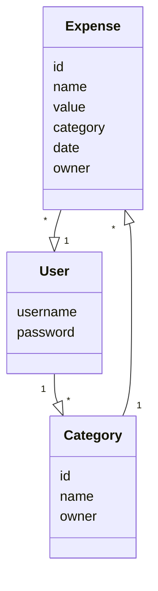
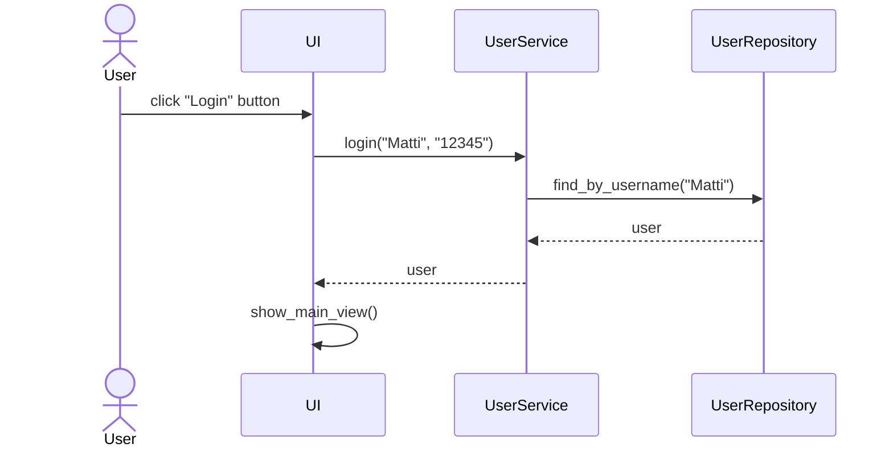
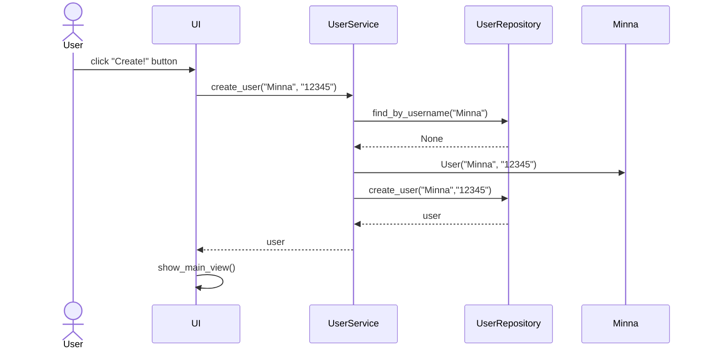
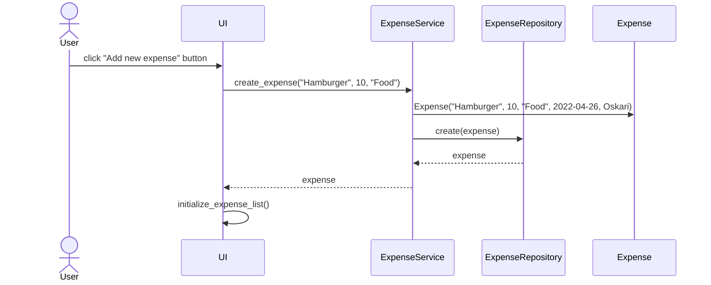

# Architecture

## Structure
The application has four different directories: _ui_, _services_, _repositories_ and _entities_. _Ui_ includes code related to user interface, _services_ includes code related to application logic, _repositories_ includes code related database operations and finally _entities_ includes classes that the rest of the directories operate with.

## User interface
The application has four different views: _login view_, _create user view_, _main view_ and _expense view_. Only one view is shown at the time, and UI-class is responsible for managing what view is shown at each time. 

- _Login view_ has a form where user can log in with an existing user account. 
- _Create user view_ has a form where user can create a new user account. 
- _Main view_ is shown for users that are logged in, and it has their expenses and categories listed as well forms where the user can add new expenses and categoriesys show
    - Each time that new expense or category is created or removed, the application automatically refreshes the page, so that it always shows the actual content.
- _Expense view_ shows information of specified expense and a form where the user can change information of that expense.

## Application logic
Application has three entities that serve the use of the application; User, that represent the user, Expense,that represent the expense of the users and Category, that represent the expense categories of certain user.

Functionalities are included in the _services_ directory, to UserService, ExpenseService and CategoryService. Each user interface has one of these classes, and they provide functionalities to it. 

Database operations are included in the _repositories_ directory, where is UserReposiroty, ExpenseRepository and CategoryRepository. Again each user interface has one of each of these classes, and with help of them the application can save and read data from database.

## Main functionalities

### User login

In the login view, after the user has given username and password as input and pressed _Login_, following sequence happens:

Pressing the button calls UserService method login with parameters given in the input fields (username and password). UserService uses UserRepository to find out whether username exists or not and if password matches. If they match, user interface changes view to MainView.

### Creating new account
In the create account view, after the user has given username and password as input and pressed _Create!_, following sequence happens:

Pressing the button calls UserService method create_user with parameters given in the input fields (username and password). UserService uses UserRepository to find out whether username is already in use. If username is free, application creates new user and calls UserRepository method create to save account to database. After that, user interface changes view to MainView

### Creating new expense 

In the main view, the user can fill in name and value of new expense, and select category from existing categories. When user clicks "Add new expense" -button, following sequence occurs:

UI-class calls create_expense function with parameters that user has given as input. Application creates new Expense object (it also adds user as owner and date to be now) and saves it to database with ExpenseRepository object. Then UI refreshes the view so that it includes the new Expense object

### Other functionalities
Same principles apply for other functionalities as well. Whenever user creates somtehing new, updates information or removes information, user interface calls method in either UserService, ExpenseService or CategoryService, and then that method calls other method in either UserRepository, ExpenseRepository or CategoryRepository. When everything is done, user interface is updated so that it always shows up-to-date information.
