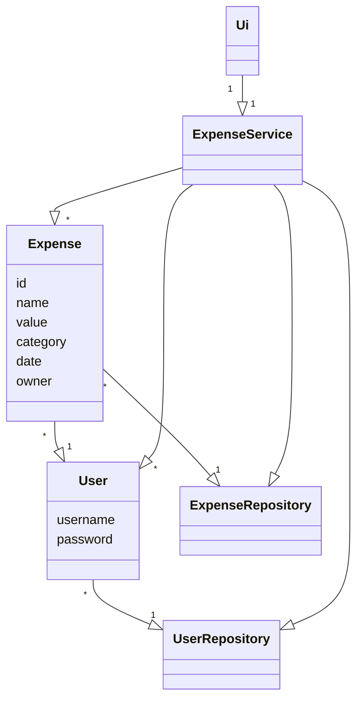
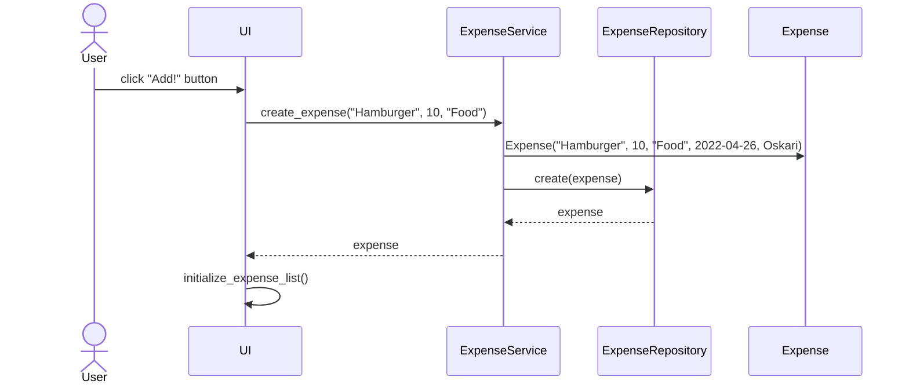

``` mermaid 

classDiagram
    class Expense{
        id
        name
        value
        category
        date
        owner
    }
    class User{
        username
        password
    }
    Expense "*" --|> "1" ExpenseRepository
    Expense "*" --|> "1" User
    User "*" --|> "1" UserRepository
    ExpenseService  --|> "*" Expense
    ExpenseService  --|> "*" User
    ExpenseService  --|>  ExpenseRepository
    ExpenseService  --|>  UserRepository
    Ui "1" --|> "1" ExpenseService

```

## Creating new expense 

```mermaid

sequenceDiagram
    actor User
    User ->> UI: click "Add!" button
    UI ->> ExpenseService: create_expense("Hamburger", 10, "Food")
    participant ExpenseRepository
    ExpenseService ->> Expense: Expense("Hamburger", 10, "Food", 2022-04-26, Oskari)
    ExpenseService ->> ExpenseRepository: create(expense)
    ExpenseRepository -->> ExpenseService: expense
    ExpenseService -->> UI: expense
    UI ->> UI: initialize_expense_list()
```
