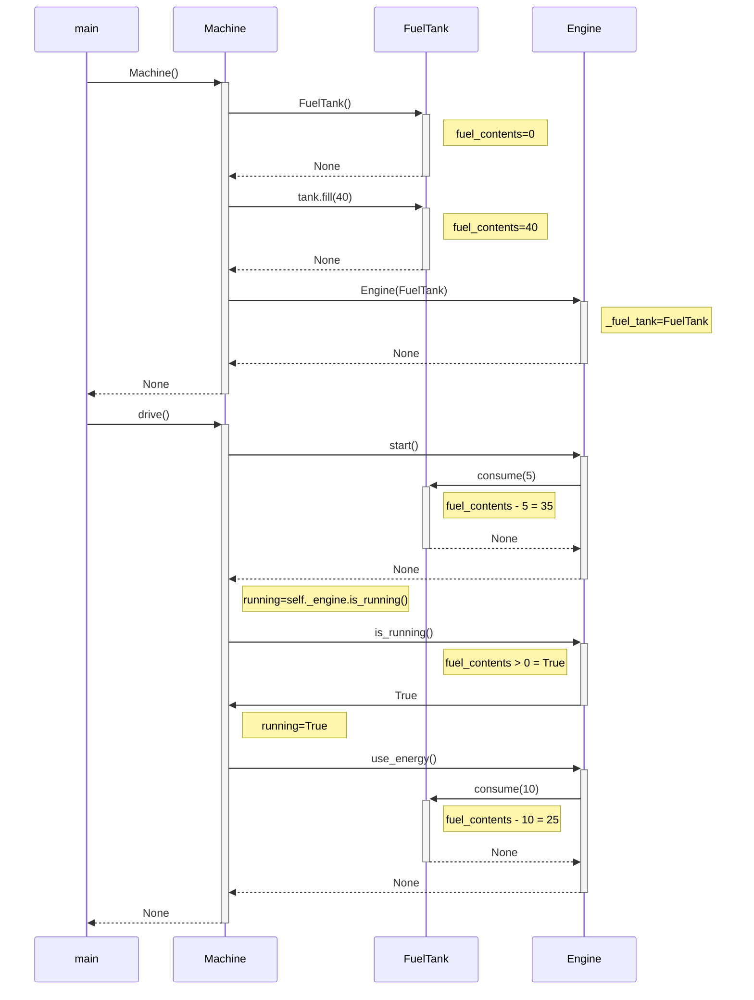

```mermaid

sequenceDiagram
    participant main
    participant Machine
    participant FuelTank
    participant Engine
    main->>+Machine: Machine()
    Machine->>+FuelTank: FuelTank()
    Note right of FuelTank: fuel_contents=0
    FuelTank-->>-Machine: None
    Machine->>+ FuelTank: tank.fill(40)
    Note right of FuelTank: fuel_contents=40
        FuelTank-->>-Machine: None
    Machine->>+Engine:Engine(FuelTank)
    Note right of Engine: _fuel_tank=FuelTank
    Engine -->>-Machine : None
    Machine -->>-main: None

    main ->>+Machine: drive()
    Machine->>+Engine:start()
    Engine->>+FuelTank:consume(5)
    Note right of FuelTank: fuel_contents - 5 = 35
    FuelTank -->>-Engine: None
    Engine -->>-Machine: None
    Note right of Machine: running=self._engine.is_running()
    Machine->>+Engine:is_running()
    Note right of FuelTank: fuel_contents > 0 = True
    Engine->>-Machine:True
    Note right of Machine: running=True
    Machine->>+Engine: use_energy()
    Engine->>+FuelTank: consume(10)
    Note right of FuelTank: fuel_contents - 10 = 25
    FuelTank-->>-Engine: None
    Engine-->>-Machine:None
    Machine-->>-main:None
```